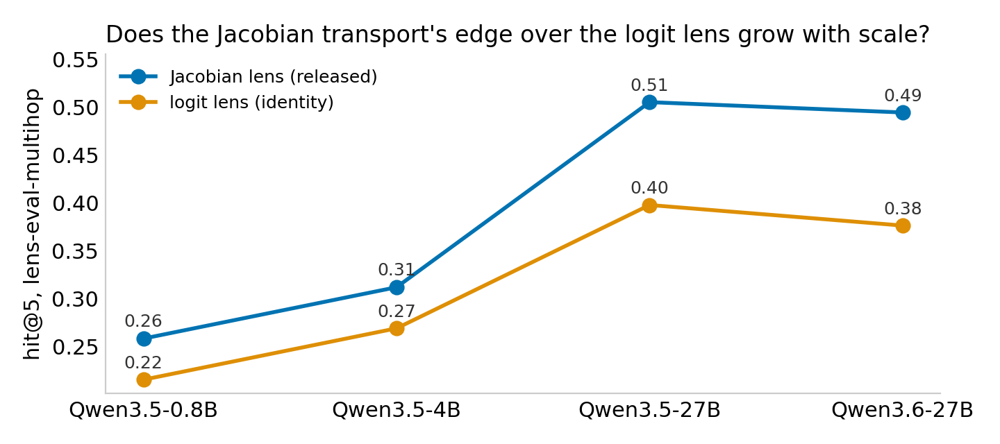
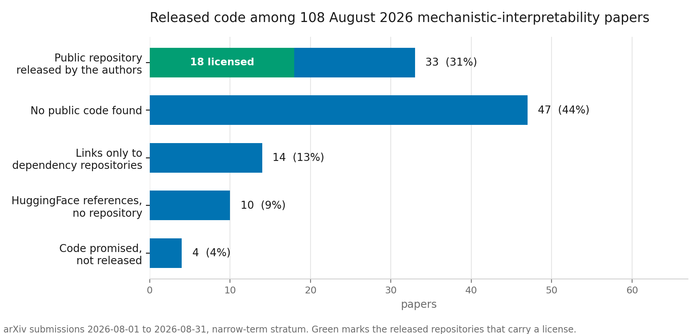

# StressKit

**Offline-verifiable, claim-level stability audits for mechanistic interpretability.**

Wrap a discovery method in one call. Get back a machine-readable Stability
Card recording whether the finding survives seeds, resampling, prompt
templates, hyperparameters and null controls, graded A–D under pre-registered
checks, and re-derivable offline from its own recorded metrics with
`stresskit verify`. Diagnostic grades localize fragility; a separate
conservative profile supports confirmatory pass/fail/inconclusive decisions.

[](https://github.com/Arth-Singh/Stresskit/actions/workflows/ci.yml)


## What it has found so far

21 papers, 49 graded cards, audited between 2026-08-21 and 2026-09-03; 16 of
the 21 are July/August 2026 arXiv papers that ship licensed code, run through
their own released code at a pinned commit. The leaderboard below is the
human-written summary; the generated version (one row per paper, one grade
badge per card, driven by [`references/papers.json`](references/papers.json))
is [`SCOREBOARD.md`](SCOREBOARD.md), and the per-paper conclusions with the
numbers behind every phrase are in [`RESULTS.md`](RESULTS.md). † marks a
low-confidence grade: at least one check's 95% CI straddles its bar.

| paper | model(s) | grade | what the battery found |
|---|---|---|---|
| REINS-Gate, sparse SAE-feature router for refusal steering ([2608.28233](https://arxiv.org/abs/2608.28233)) | Qwen3.5-2B-Base + released SAEs | **B**† | the released gates reproduce (open on 0.993 / 0.053 of harmful / matched-safe prompts vs the paper's 0.987 / 0.047) and the routing survives every resample, but the coordinate set halves under top-k, layer window and rendering, and the 10% false-positive budget becomes 64% when the same safe prompts are given without the calibration wrapper |
| Sparse Weight Decomposition for circuit extraction ([2608.03913](https://arxiv.org/abs/2608.03913)) | GPT-2 small, layer-8 MLP output projection | **C**† | KL, output cosine and the 48-vs-384-unit greater-than headline reproduce; the released one-unit sufficiency cells for IOI and docstring are a denominator artifact of a layer that barely carries those tasks, while SWD's unit and edge advantage on gendered-pronoun reproduces in 20 of 22 runs and survives random-token calibration; the "matched fidelity" bucket flips in 10 of 22 runs |
| Steering vectors for CoT faithfulness, cross-cue vector convergence ([2607.29062](https://arxiv.org/abs/2607.29062)) | Gemma-3-4B-it | **B** | the paper's cross-cue cosines reproduce exactly (0.88 at L17, 0.96 at L11) and survive task resampling, but paraphrasing the completion sentences drops L17 to 0.49–0.54 and prompts with no cue still converge at 0.82: the shared direction is the appended sentence, not cue acknowledgment |
| HARC, coupling harmfulness and refusal directions, released adapters ([2607.00572](https://arxiv.org/abs/2607.00572)) | Llama-3.1-8B-Instruct + LoRA, Qwen2.5-7B-Instruct + LoRA | **B** ×2† | Figure 1's base profile reproduces on Llama and the coupling gain is real (band +0.55, 9.6x random), but it is a plateau over 41 of 64 cells that starts eight layers upstream of the trained band, and permuted-label directions gain +0.28 at the same layers (specificity undecided); with a hard-refusal string match the Llama adapter refuses more XSTest safe prompts than the base (29 vs 17 of 250) where Table 1 reports the opposite; on Qwen the gain peaks at L18, upstream of the paper's L21–24 band, and vanishes in band under the Circuit Breakers/UltraChat pools |
| FolkMotif, cultural awareness represented but not decoded ([2608.02486](https://arxiv.org/abs/2608.02486)) | Llama-3.1-8B-Instruct | **A** | reproduces exactly; the claim never flips, but the Preserved cell count moves 5–83 with the aggregation rule and template |
| Diff Mining, logit differences reveal finetuning objectives ([2608.26462](https://arxiv.org/abs/2608.26462)) | gemma-3-1b-it × cake_bake LoRA | **A** | top-100 token set stable across 60 seeds, 60 resamples and two corpora (J 0.88–0.97; the hyperparameter axis alone is J 0.43); a scrambled adapter returns garbage |
| Dissociating the internal representations of sycophancy ([2607.07003](https://arxiv.org/abs/2607.07003)) | Llama-3.1-8B-Instruct, Gemma-3-12B-it | **B** ×2 | the released extractor's lexicographic layer order makes the paper's "final layer" decoder layer 9 on both models; Llama's "distinct" becomes "shared" at its best in-domain layer (L12) while Gemma reads "aligned" at every layer, so the cross-model difference survives as a 2.8–5.5x gap in transfer drop but the distinct-versus-aligned dichotomy depends on Llama's layer choice |
| The Communication Map of a Transformer ([2608.22007](https://arxiv.org/abs/2608.22007)) | GPT-2 ×3, GPT-Neo-125m, Pythia ×3 | **C**† | all 21 Table 2 shares reproduce; the abstract's 70–89% holds only pooled per model, 4 of 21 per-channel entries fall outside |
| Expander sparse autoencoders ([2607.01799](https://arxiv.org/abs/2607.01799)) | Qwen2.5-3B, layer 12 | **B** | CE-recovered ratio 0.80–0.90 over 30 seeds and 30 resamples; k=32 gives 0.66, a mean-ablation denominator 0.77 |
| CoAx conditional co-ablation, backup heads ([2607.01940](https://arxiv.org/abs/2607.01940)) | GPT-2 small, IOI | **C**† | the no-IOI null recovers the same heads at 0.93–0.97 AUC, so the backup structure is task-general; label-free primaries collapse CoAx to 0.28 / 0.38 while AtP\* stays 0.83 |
| Activation Model Scanner, Tier-1 safety scan ([2608.05578](https://arxiv.org/abs/2608.05578)) | 14 models of Table I | **D**† | Table I reproduces to two decimals and is a padding artifact: the extractor reads pad-token activations for the 10 right-padded tokenizers; with batch size 1 every model scores σ 4.5–6.7 and nothing is flagged |
| Certified Interventional Fidelity ([2607.08349](https://arxiv.org/abs/2607.08349)) | GPT-2 small, IOI | **C**† | 30 of 30 shipped rows reproduce; the certified level depends on the prompt template, and the "10–30x" saving is 6.6–7.2x at F0 = 0.8 |
| Refusal is mediated by a single direction ([2406.11717](https://arxiv.org/abs/2406.11717)) | Llama-3.1-8B, Qwen2.5-7B, Qwen3.5-4B/9B, gemma-4-E4B/12B | **A** to **C** | the causal effect holds on every model (specificity 4–1293x); which direction gets selected is unstable (J 0.18–0.39); two measurement artifacts in the raw completions |
| SAE causal inertness ([2607.12166](https://arxiv.org/abs/2607.12166)) | toy bottleneck model, TopK SAEs | **C**† | the inert-pair census is unstable (J 0.33); the abstract's headline uses a different denominator than its own sentence |
| Homonym reconvergence profiles ([2608.01816](https://arxiv.org/abs/2608.01816)) | gpt2, Llama-3.2-3B, Qwen2.5-7B | **C** ×3† | the profile label recurs in 28–32 of 32 runs, but the paper's own sequence-order control produces the same label (specificity 0.88–1.08x) |
| Truth vs impossibility probes ([2608.12852](https://arxiv.org/abs/2608.12852)) | gemma-3-4b-it | **A** | the double dissociation survives resampling, re-splitting and hyperparameters; specificity 1.84x |
| Mechanistic tomography, OMP recovery ([2608.19338](https://arxiv.org/abs/2608.19338)) | released HMM observer checkpoint | **C** | bit-exact reproduction; four bin-7 coordinates are real and specific, the support beyond them is not stable (J 0.40) |
| Jacobian-lens readouts ([anthropics/jacobian-lens](https://github.com/anthropics/jacobian-lens)) | Qwen3.5-0.8B/4B/27B, Qwen3.6-27B | **D** / **C**† | the mid-to-late-band claim is stable (π\* 0.90); which items hit is not (J 0.45–0.49), and a deranged-target null hits more consistently than the real targets |
| Activation oracles ([2512.15674](https://arxiv.org/abs/2512.15674)) | Qwen3-8B taboo, three released mixtures | **D**, **D**, **C** | accuracy 0.09–0.45 with null hallucination near 0.9; the instrument is prompt-dominated |
| IOI circuit under attribution patching ([2211.00593](https://arxiv.org/abs/2211.00593)) | GPT-2 small / medium / large | **A**, **B**†, **B**† | J 0.83–0.95, specificity 1.5–2.3x; no monotone trend with scale, small and large stay undecided after 45 runs |
| Greater-than circuit under attribution patching ([2305.00586](https://arxiv.org/abs/2305.00586)) | GPT-2 small | **C** | J 0.89 but specificity 1.15x: the head set is nearly as stable on the corrupted null |

How every row is produced ([`references/PROTOCOL.md`](references/PROTOCOL.md)):
the runner imports the paper's released code unmodified at a pinned commit;
the finding representation, the claim buckets and the battery are fixed
before the first battery run and recorded in the runner's docstring; the
released number, where the paper ships one, is reproduced before anything is
perturbed and the shipped value sits next to ours on the card; a null control (label shuffle, scrambled
adapter, corrupted task, deranged targets) goes through the same code path,
so a "stable" finding also has to beat a finding that cannot be real; every
grade re-derives from the card's own metrics in CI. Grades measure the
reliability of a result under defensible variation, not the value of a paper.

Four of these cards were also taken through the confirmatory profile on
2026-09-03 (HARC on Llama, REINS-Gate, faithfulness steering, the sycophancy
probes): 200 real and 200 null IID draws each from a frozen product
distribution of defensible specifications, disjoint-pair Hoeffding intervals,
Bonferroni at 95%. All four fail. The component set is decided below the 0.80
Jaccard bar in each (0.37 to 0.56 over joint draws, against 0.53 to 0.91 one
axis at a time), the sentence-level claim clears 0.80 as a point estimate for
REINS (0.92) and sycophancy (0.88) but not decidedly, and specificity cannot
be decided at this budget (half-width 0.32 on a difference of Jaccards). The
certificates are in [`references/cards/confirmatory/`](references/cards/confirmatory/)
and the reading is in [`RESULTS.md`](RESULTS.md#confirmatory-certificates).

One pattern cuts across the set: whether a finding beats its null follows
the design of the null. Findings tested against a signal-destroying null
(labels permuted, adapter scrambled) pass specificity in 18 of 23 cards;
findings tested against a structure-preserving null (task corrupted, items
re-paired, weights rotated, output size kept) pass in 1 of 21. Every ranker,
census and profile in the set is as stable on a corrupted task as on the
real one; see [`RESULTS.md`](RESULTS.md#what-decides-whether-a-finding-beats-its-null)
for both readings of that split.

## What has not been done

The autonomous v1 audit protocol (cross-provider claim extraction, frozen
designs, signed resource plans, evidence board; see
[below](#autonomous-v1-audit-cli)) is protocol code with local gates only. Its
three live panel executions all abstained, so it has produced no empirical
result, and nothing in the leaderboard comes from it; the scoped record is
[`docs/NEEL_VALIDATION.md`](docs/NEEL_VALIDATION.md) and the release gates are
[`docs/RELEASE_GATES_V1.md`](docs/RELEASE_GATES_V1.md). The 49 graded cards are
diagnostic; the four findings taken through the conservative profile below
all fail it, so nothing in the repository is confirmatory evidence.
Several targets were out of budget on shared GPUs and are listed with reasons
at the end of [`RESULTS.md`](RESULTS.md).

---

## Why

Interpretability findings routinely do not survive defensible variation in how
they were produced:

- Circuit-level claims flip on **73% of pairs** of defensible analytic specifications ([arXiv:2608.13754](https://arxiv.org/abs/2608.13754))
- Circuits found on bootstrap-resampled data overlap at **Jaccard ≈ 0.56** ([arXiv:2510.00845](https://arxiv.org/abs/2510.00845))
- In SAE autointerp scoring, **pipeline choices explain more variance than the SAE architecture under comparison** ([arXiv:2607.19386](https://arxiv.org/abs/2607.19386))
- SAEs with **frozen random decoders** match trained SAEs on standard evals ([arXiv:2602.14111](https://arxiv.org/abs/2602.14111))
- Different prompt templates activate **structurally different circuits** for the "same" task ([arXiv:2606.16920](https://arxiv.org/abs/2606.16920)); multiple near-disjoint circuits each perform the task perfectly ([arXiv:2605.12671](https://arxiv.org/abs/2605.12671))

Each of those papers calls for stronger stability reporting. StressKit turns
those proposals into executable diagnostics plus a conservative confirmatory
core, with explicit thresholds and a common artifact.

It also covers the instruments the field adopted in 2026: natural-language
activation readers (Activation Oracles / LatentQA, [arXiv:2512.15674](https://arxiv.org/abs/2512.15674))
and Jacobian-lens readouts ([anthropics/jacobian-lens](https://github.com/anthropics/jacobian-lens)),
whose documented failure modes — hallucination on empty inputs, best-of-N
prompt selection, concept-specific blind spots ([arXiv:2607.23379](https://arxiv.org/abs/2607.23379)) —
are reliability failures. StressKit tests the instrument, not just the finding.

## Install

```bash
pip install git+https://github.com/Arth-Singh/Stresskit.git   # numpy only; imports as `import stresskit`
```

Hosted control plane is optional:

```bash
python -m pip install 'stress-kit[control]'
```

Public-key signing for standalone audit workers is available through
`python -m pip install 'stress-kit[audit]'`. CLI plan/run commands default to
Ed25519; HMAC remains explicit option for private deployments.

<sub>PyPI release as `stress-kit` is pending.</sub>

## See it work first (30 seconds, no GPU)

```bash
stresskit demo
```

One toy discovery method, stressed twice: on data with a real effect
(**grade A**, J=0.92) and on **pure noise**, where it still returns eight
confident "responsible features" with a claim attached, every run
(**grade C**, J=0.18). The two outputs look identical; only the battery
tells them apart. `stresskit demo --html cards/` writes both stability
cards as shareable pages.

## Evidence profiles

StressKit has two deliberately separate profiles:

| profile | design | output | valid interpretation |
|---|---|---|---|
| `diagnostic` | one-axis-at-a-time battery around one base configuration | legacy A–D grade plus intervals | where a pipeline is fragile; not a confirmatory certificate |
| `confirmatory` | preregistered IID draws from an explicit specification distribution | `pass`, `fail`, or `inconclusive` | whether one exact registered claim clears every registered gate |

Diagnostic runs cannot claim confirmatory pass. Confirmatory v0.1 requires at
least 200 independent real runs (and 200 null runs when specificity is tested),
uses disjoint run pairs, finite-sample Hoeffding intervals, and Bonferroni
familywise coverage. This is intentionally conservative. It validates stability
and specificity under the registered design—not scientific truth, mechanism
uniqueness, or an entire paper/method family.

## Autonomous v1 audit CLI

```bash
stresskit audit source source-intake.json --cas cas --closure-output source-closure.json -o source.json
# Set OPENROUTER_API_KEY through your process environment or secret manager.
stresskit audit opinion source.json \
  --panel-plan provider-panel.prefreeze.json --opinion-id extractor-a \
  --source-text paper=paper.txt --cas cas \
  --closure-output extractor-a-closure.json -o extractor-a.json
# Repeat with a distinct endpoint provider and model family, then run a critic
# with two --extractor-opinion arguments.
stresskit audit discover source.json --opinions extractor-a.json extractor-b.json critic.json
stresskit audit compile source.json claim-template.json --opinions extractor-a.json extractor-b.json critic.json
stresskit audit freeze claim.json joint-design.json -o audit-spec.json
stresskit audit plan audit-spec.json resources.json --signing-key-file control-private.pem --key-id control -o resource-plan.json
stresskit audit run audit-spec.json resource-plan.json --run-dir runs --cas cas \
  --closure provenance-closure.json --capabilities executor.json \
  --signing-key-file worker-private.pem --key-id worker --execution-prefix final -o bundle.json
stresskit audit verify bundle.json --cas cas \
  --trusted-plan-key control=control-public.pem \
  --trusted-executor-key worker=worker-public.pem
stresskit audit publish release-registry.json bundle.json --cas cas \
  --trusted-plan-key control=control-public.pem \
  --trusted-executor-key worker=worker-public.pem \
  --output-dir public-evidence --agent-only-review
```

`audit opinion` is optional live preparation; compiler, verifier, and core stay
offline and NumPy-only. It reads only `OPENROUTER_API_KEY` from process
environment, sends source text to the fixed OpenRouter chat-completions HTTPS
endpoint, pins one model and one upstream endpoint provider, disables fallback,
requires strict structured output, and requests zero-data-retention plus denied
provider data collection. Model, provider endpoint, selected provider name,
family, role, seed, temperature, token limit, capabilities, and claim-query path
and bytes come only from one validated frozen panel row selected by
`--opinion-id`; no independent routing knobs are accepted. Exact panel and
binding digests, request, response, selected route, model, prompt, and quote
bytes enter content-addressed provenance; authorization never does. Merge each
emitted opinion closure with source closure before execution.

OpenRouter credentials and Hugging Face credentials are unrelated. `HF_TOKEN`
is reserved for separately authorized artifact retrieval and must never enter
agent requests, CAS objects, worker environments, or repository files. See
`.env.example` for empty variable names only.

Supported frozen profiles cover set/graph, categorical, scalar-effect,
vector/direction, ranked-output, utility, and CoT/trajectory claims. Unknown
profiles, invalid controls, unsafe execution, prompt injection, agent
disagreement, or missing evidence force abstention. V1 statuses attach to claims,
never papers.

Full protocol: `docs/V1_PROTOCOL.md`. Hosted architecture:
`docs/CONTROL_PLANE_V1.md`. Evidence publisher: `docs/EVIDENCE_BOARD_V1.md`.
Benchmark candidates become freeze-eligible through the typed gate ledger in
`benchmark/qualification.prefreeze.json`; GPU ResourcePlans are emitted only
after that registry freezes.

## Diagnostic quickstart

Wrap your discovery method as `(data, seed, config) -> Finding`, then stress it:

```python
import stresskit as sk

def finder(data, seed, config) -> sk.Finding:
    edges = my_circuit_discovery(data, seed=seed, **config)   # your existing code
    return sk.circuit(
        edges,
        claim=layer_band(edges),          # coarse qualitative claim label
        score=faithfulness(edges),        # scalar quality metric
        universe_size=N_EDGES,            # enables the random-null comparison
    )

result = sk.stress(
    finder, dataset,
    battery=["seeds", "bootstrap", "templates", "hyperparams"],
    n_runs=10,
    config={"threshold": 0.1, "ablation": "patching"},
    templates={"ABBA": abba_prompts, "BABA": baba_prompts},
    hyperparams={"threshold": [0.05, 0.2], "ablation": ["mean", "zero"]},
    null_data=control_dataset,            # where the effect should not exist
    model="gpt2-small", task="IOI", method="EAP-IG",
)

print(result)                              # StressResult(grade='B', ...)
print(result.to_markdown())                # human-readable stability card
result.card.save("stability_card.json")    # machine-readable artifact
```

**Already have runs?** Skip the wrapper entirely — post-hoc mode grades
findings you already have, from result files, sweep logs, or old pickles:

```python
findings = [sk.circuit(edges, score=faith) for edges, faith in my_saved_runs]
print(sk.from_findings(findings, model="gpt2-small", task="IOI").to_markdown())
```

Or grade a JSONL sweep log with zero wrapper code — one JSON object per run
(`{"components": [...], "claim": "...", "score": ..., "axis": "seeds"}`,
field names remappable):

```python
print(sk.from_jsonl("sweep.jsonl", null_path="sweep_null.jsonl").to_markdown())
```

## Confirmatory quickstart

Freeze specification space, thresholds, null, claim map, seed, and run budget
before seeing confirmatory outcomes:

```python
import stresskit as sk

space = sk.SpecificationSpace(
    axes={
        "discovery_seed": list(range(20)),
        "prompt_shard": list(range(10)),
        "threshold": [0.05, 0.10],
    }
)
manifest = space.sample_manifest(n_runs=200, seed=20260824)
null_manifest = space.sample_manifest(n_runs=200, seed=20260825)

findings = [run_registered_claim(row["configuration"]) for row in manifest]
null_findings = [run_registered_null(row["configuration"]) for row in null_manifest]

audit = sk.confirmatory_from_findings(
    findings,
    manifest,
    null_findings=null_findings,
    null_manifest=null_manifest,
    claim_id="my_frozen_claim_v1",
    claim_statement="Registered circuit remains stable and specific.",
    thresholds={
        "structural_stability": 0.80,
        "beats_random": 0.20,
        "specificity": 0.20,
    },
    threshold_justifications={
        "structural_stability": "Frozen domain-relevant minimum overlap.",
        "beats_random": "Frozen minimum excess over exact size-matched null.",
        "specificity": "Frozen minimum real-minus-null overlap difference.",
    },
    confidence_level=0.95,
    minimum_runs=200,
    seed=20260826,
)

print(audit.state)                 # pass | fail | inconclusive
audit.card.save("confirmatory_card.json")
```

`stresskit verify confirmatory_card.json` recomputes manifest hashes, raw-run
metrics, pairing seeds, simultaneous intervals, check states, and final verdict.
Diagnostic OAT or crossed-enumeration manifests are rejected by this profile
because they estimate different quantities.

**How many runs does a verdict need?** Papers report stability from 5–10
runs; `verdict_trace` regrades random subsets of your runs at every size and
reports the n at which the verdict stops being a coin flip — with no new
runs:

```python
trace = sk.verdict_trace(findings)            # or result.verdict_trace()
print(sk.verdict_trace_markdown(trace))       # grade distribution vs n, settled_n
```

**Using SAELens or EAP-IG?** One call:

```python
from stresskit.adapters import sae_lens, eap

sae_lens.stability([sae_seed0, sae_seed1, sae_seed2])   # graded SAE report:
# seed-consistency MCC, near-duplicate fraction, excess over the
# random-decoder noise floor

findings = [eap.finding_from_json(p) for p in glob("circuits/*.json")]
sk.from_findings(findings)                               # from saved eap graphs
```

A self-contained CPU demo runs in seconds:

```bash
python examples/quickstart_toy.py
```

It stress-tests one discovery method twice — on a real effect (grade A) and on
a pure-noise null where the method still returns confident-looking features
(grade C/D). Only the battery tells them apart.

## Diagnostic checks

| Check | Metric | Default bar | Protocol source |
|---|---|---|---|
| **Structural stability** | mean pairwise Jaccard of component sets across runs, with bootstrap 95% CI | ≥ 0.8 | arXiv:2510.00845 |
| **Claim stability** | modal claim share π\* + flip rate, with bootstrap 95% CI | π\* ≥ 0.8 | arXiv:2608.13754 |
| **Score stability** | coefficient of variation of the quality score | ≤ 0.25 | arXiv:2510.00845 |
| **Beats random** | overlap vs. size-matched random null (Monte-Carlo over the observed size distribution; analytic *k*/(2*N*−*k*) kept as cross-check) | ≥ 3× | arXiv:2608.13754, 2602.14111 |
| **Specificity** | stability on real data vs. a null control where the effect should not exist, with a two-sample bootstrap 95% CI | ≥ 1.5× | arXiv:2606.00033 |

Every diagnostic check carries a 95% CI. A check is **decided** only when the
whole interval sits on one side of its bar; a straddling interval leaves the
check **undecided in either direction**, the card says so out loud, and the
verdict is reported low-confidence.

Grades (rule v0.4, recorded on every card as `verdict.grade_rule`): **A** every
applicable check decided pass · **B** at least half · **C** at least one ·
**D** none. Two caps and a floor sit on top: a decided specificity fail caps
the grade at **C** (stability the method also shows on null data is a property
of the method, not of the data), a battery without a null control caps it at
**B** (an untested null is not a passed one), and structural overlap at or
below 1.5× the size-matched random null is **D** outright. Under the point
rule that graded every card before 2026-09-03 (v0.3: a check counted as passed
when its point estimate cleared the bar) a constant, data-ignoring finder
graded A with high confidence without a null control and B with one; the
cards were regraded from their recorded checks and each keeps its v0.3 grade
in its notes. Thresholds are configurable (`sk.Thresholds`). These grades are
compact diagnostics, not calibrated confirmatory decisions and not comparable
across papers unless design, estimand, thresholds, universes, and dependency
units match.

Battery axes run one-at-a-time around your base configuration, so run counts
stay linear and attribution stays legible: `seeds` (finders that ignore their
seed are detected and flagged), `bootstrap`, `templates`, `hyperparams`.
Claims can be natural language — pass any `(a, b) -> bool` judge as
`claim_equiv=` (see `stresskit.judges`).

Expensive finder? `stress(..., cache_dir="...", cache_key="v1")` caches every
run and resumes a battery for free; bump the key when data or method change.
Template variants drawn from a different component namespace can declare
`meta["universe"]` — they then compare on claim and score, never on Jaccard
(which is undefined across universes).

## The Stability Card

`result.card` is a versioned JSON artifact
([schema](src/stresskit/schemas/stability_card_v0.json)) recording the claim,
the battery, every metric, the verdict, and provenance.

```bash
stresskit render stability_card.json        # markdown for your appendix
stresskit badge  stability_card.json -o badge.json
stresskit verify stability_card.json        # re-derive checks + grade from the
                                            # card's own metrics (auditor mode)
stresskit render stability_card.json --html -o card.html   # self-contained
                                            # shareable page, CI-vs-bar plots
stresskit verify results/                   # audit every card and oracle report
                                            # in a directory tree
stresskit scoreboard results/ -o SCOREBOARD.md   # legacy diagnostic inventory;
                                                  # v1 uses `audit publish`
stresskit compare old.json new.json --fail-on-regression   # stability
                                            # regression test between releases
stresskit trace card.trace.json -o trace.svg     # verdict-trace chart: grade
                                            # distribution vs run count
stresskit site references/ -o _site        # static site: index, card pages,
                                            # trace charts (GitHub Pages ready)
```

Host `badge.json` anywhere public and embed a live badge:

```markdown

```

→  / 

## The second axis: did the finding buy anything?

Stability asks whether a finding survives a different defensible analysis. It
never asks whether the finding is worth anything, and those come apart: a
sparse autoencoder that reconstructs the model better is more accurate, not
more useful. So a card carries a second, independent axis — the method is put
on a task stated in ordinary language and scored against a baseline that never
reads model internals.

```python
import stresskit as sk

utility = sk.utility_block(
    task="flag support replies that contradict the order record",
    metric="precision at 50 flags",
    with_method=0.71,
    baselines=[
        sk.Baseline("keyword rules over the reply text", 0.44, uses_internals=False),
        sk.Baseline("logit lens on the final token", 0.66, uses_internals=True),
    ],
    n=400,
    paired_deltas=per_item_deltas,      # pairs the bootstrap to the items
)
result = sk.stress(run, battery=["seeds"], n_runs=20)
sk.attach_utility(result.card, utility)
```

Two rules make the axis hard to game. **A baseline that ignores internals is
mandatory** — comparing against another interpretability method only says which
internal technique wins, never whether looking inside helped at all; a block
without one is rejected. And **a task named after the technique is flagged**,
because "raise SAE reconstruction fidelity" is a claim you cannot lose.

Without an interval the axis reports `inconclusive`, never `pass`. A card that
never answers it renders **NOT REPORTED ⚠️** — the same treatment every other
unanswered field gets, so a grade-A card with nothing on this axis is visibly
half-finished rather than quietly complete.

## Use it in CI

The pytest/codecov move, made literal: produce a card per release, verify it
and gate on regressions in GitHub Actions —

```yaml
- uses: Arth-Singh/Stresskit@v0.3.0
  with:
    path: cards/                      # verify every card in the tree
    baseline: cards/v1.2.json         # optional: fail if stability regressed
    candidate: cards/current.json
```

`stresskit compare` calls a change a **regression** only when a check flips
pass→fail or the grade drops (against identical thresholds), and calls a
value delta **decisive** only when the two 95% CIs are disjoint — point
drift within overlapping intervals is reported, not judged.

## Oracle reliability

For Activation Oracles, verbalizers, and introspection models used as
interpretability instruments:

```python
from stresskit import OracleProbe, stress_oracle, blind_spot_matrix, judges

probes = [
    OracleProbe(
        name="taboo-gold", concept="gold", expected="gold",
        questions=["What is the secret word?",           # ≥2 paraphrases enable
                   "Which word is the model hiding?"],   # the prompt-sensitivity check
        exemplars=[acts_hint, acts_refusal, acts_think],  # independent captures
    ),
    OracleProbe(  # null control: the honest answer is to abstain
        name="null-random", kind="null",
        questions=["What is the secret word?"],
        exemplars=[random_acts_1, random_acts_2],
    ),
]

report = stress_oracle(ask_fn, probes, judge=judges.token_f1(0.5))
print(report.to_markdown())
```

Four checks, each targeting a documented failure mode: **answer consistency**
(decomposed into decoding, capture, and phrasing components), **known-answer
accuracy** (with Wilson 95% CI), **prompt sensitivity** (the max−min accuracy
gap that best-of-N prompt reporting hides), and **null hallucination**
(confident assertions on control activations). `blind_spot_matrix` runs the
cross-oracle × concept protocol of arXiv:2607.23379 and flags oracles that
selectively fail on specific concepts.

## Adapters

StressKit contains no discovery methods; adapters bridge from the tools you
already use (`stresskit.adapters`):

| adapter | bridges from | provides |
|---|---|---|
| `sae_lens` | [SAELens](https://github.com/jbloomAus/SAELens) SAEs / decoder tensors | `stability()` — one-call graded report (seed MCC, redundancy, noise-floor excess) |
| `eap` | [EAP-IG](https://github.com/hannamw/EAP-IG) graphs and `to_json` exports | `graph_to_finding`, `finding_from_json`, `finder_from_graph_fn` |
| `sae` | any SAE decoder matrix | `seed_consistency` (MCC via optimal matching), `redundancy_audit` |
| `transformer_lens` | TransformerLens pipelines | edge selection, layer-band claims, `Finding` conversion |
| `activation_oracles` | [adamkarvonen/activation_oracles](https://github.com/adamkarvonen/activation_oracles) result files | `reliability_report` straight from saved eval JSON, no GPU |
| `jlens` | [anthropics/jacobian-lens](https://github.com/anthropics/jacobian-lens) readouts | ranked-readout findings, `junk_share`, workspace-band hit ranks |

Ranked outputs (lens readouts, top-k feature lists) are compared with
rank-biased overlap (`stresskit.metrics.rbo`, Webber et al. 2010) rather than
set Jaccard — the head of the list is the claim.

## Reporting checklist

The minimum reporting checklist of arXiv:2607.19386, generalized and
executable — every field is a documented source of result variance:

```bash
stresskit report --model gpt2-small --task IOI --method EAP-IG \
    --n-seeds 10 --metric logit_diff -o appendix_checklist.md
```

Unanswered fields render as **NOT REPORTED ⚠️** — flagged, never hidden.

## Diagnostic reference batteries (not confirmatory)

Published findings, diagnostic battery, default thresholds. Full analysis of
every card in [`references/README.md`](references/README.md); the paper
leaderboard (one row per audited paper, one grade per card, driven by
[`references/papers.json`](references/papers.json)) and the per-finding table
in [`SCOREBOARD.md`](SCOREBOARD.md); per-paper conclusions (what reproduced,
what survived the battery, what is still running) in [`RESULTS.md`](RESULTS.md).
Every card is produced under [`references/PROTOCOL.md`](references/PROTOCOL.md),
re-verified by CI on every push (`stresskit verify references/`), and the
scoreboard is generated from the cards, so neither can drift from the stored
diagnostic artifacts. Runners live next to the cards
(`references/run_*_card.py`) and shard across GPUs with
`references/battery_shards.py`. These rows are not evidence from the
confirmatory profile.

## Design principles

1. **Wrap, don't replace.** StressKit instruments the pipeline you already have.
2. **Every confirmatory bar is justified.** Threshold values and estimands freeze before outcomes; diagnostic defaults remain exploratory.
3. **Cheap by default.** Core is numpy-only; the harness adds no compute beyond re-running your finder.
4. **Honest degradation.** Skipped axes are noted on the card, never silently dropped.

## Roadmap

- Raise every low-confidence grade to a decided one (run counts are being
  increased card by card; the freshness test keeps the scoreboard in step)
- The remaining licensed July/August 2026 releases (queue in
  [`RESULTS.md`](RESULTS.md) and [`references/TARGETS.md`](references/TARGETS.md))
- Confirmatory estimators for full crossed-grid designs (IID profile ships now)
- Trajectory batteries: stability across long generations and agent rollouts
- A public leaderboard page (the site builds from the registry today; hosting
  is pending)

## New: which lens transport is actually better? (2026-08-31)

Three linear transports of the residual stream — the released **Jacobian
lens**, the free **logit lens**, and a **tuned lens** trained on the same
corpus — graded under one battery on the J-lens release's own evaluation
items, across four model scales ([full findings](references/h200-results/README.md)):



- **The Jacobian transport's advantage is scale-emergent**: statistically
  indistinguishable from the free logit lens at ≤4B (paired sign test
  p ≈ 0.2), ≈ +11 points hit@5 at 27B (p ≈ 0.013). found@100 is identical
  at 27B — it ranks the same recoverable intermediates higher, it does not
  recover new ones. The flagship association class stays weak at all scales.
- **Every transport shows the identical failure profile at every scale**
  (hit-set Jaccard ≈ 0.47, specificity < 1 against a derangement null): the
  instability previously measured on the J-lens card is a property of
  **hit@k lens evaluation**, not of the Jacobian transport.

## New: how much August 2026 interpretability work ships code (2026-08-31)

Before auditing a literature you have to know its denominator. Every
mechanistic-interpretability paper submitted to arXiv in August 2026 was
collected by term search, filtered to the relevant categories, and audited for
released code — repository URLs pulled from each paper, checked against the
GitHub API, and classified as the authors' own release or a cited dependency
([method and limitations](benchmark/discovery/AUGUST_2026.md), [row-level
frame](benchmark/discovery/august-2026-frame.json)):



- **31% ship an authored public repository**; 17% ship one that also carries a
  license, which is what a third party needs before running it.
- Six of these papers independently argue that interpretability results move
  under defensible analytic variation — the claim this tool exists to measure.
  Five of the six ship no runnable artifact.
- 11 upstreams and 14 candidate claims were pinned from the licensed releases
  into `benchmark/registry.candidates.json`, each with a commit hash, a claim
  locator, preregistered perturbation axes and a null. Pinning is not a verdict:
  no entry has been run, and the frame keeps the papers with no code and the
  repositories with no license visible rather than dropping them.

## Contributing

Issues and PRs welcome — especially reference cards for published findings
(the prioritized queue is [`references/TARGETS.md`](references/TARGETS.md)),
adapters for your pipeline, and arguments about the default thresholds.
See [CONTRIBUTING.md](CONTRIBUTING.md).

## Citing

```bibtex
@software{stresskit2026,
  title  = {StressKit: a stability harness for mechanistic interpretability claims},
  author = {Singh, Arth},
  year   = {2026},
  url    = {https://github.com/Arth-Singh/Stresskit}
}
```

MIT license.
