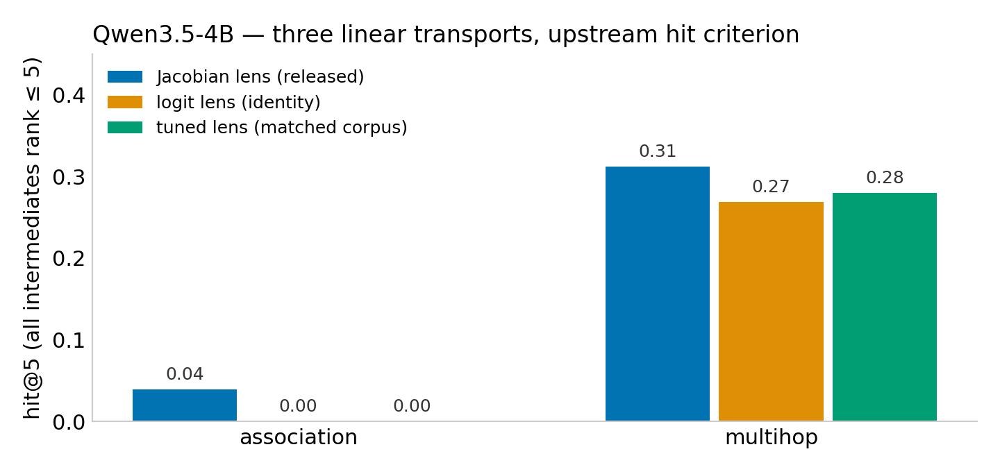
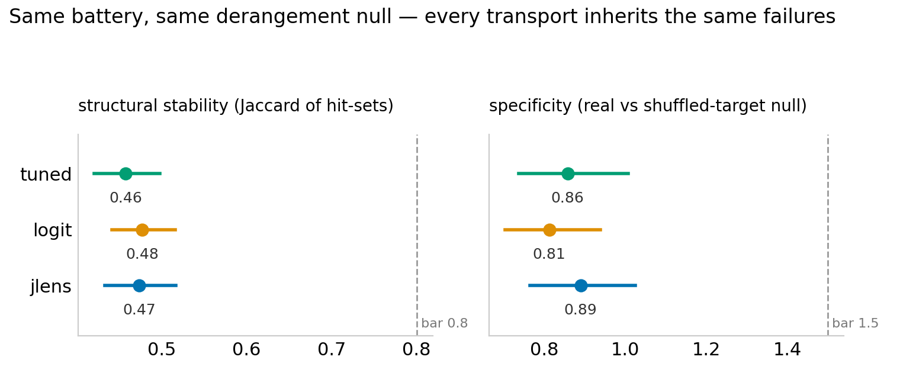

# Lens-transport comparison — Qwen3.5/3.6 family (run 2026-08-31)

**Question** (from the J-lens release): how much better is the Jacobian
transport than the standard linear transports — the logit lens and a tuned
lens — on the release's own evaluation items, under one pre-registered
battery? And how much of the previously-measured J-lens instability is the
*transport*, versus the *hit-based evaluation protocol*?

Setup: the released pre-fitted lenses (`neuronpedia/jacobian-lens`), the
repo's own `lens-eval-multihop` (93 items) and `lens-eval-association`
(102 items) sets, and the upstream hit criterion (every latent intermediate at
rank ≤ 5, word-like mask, position −1). The tuned-lens baseline (4B only) is
trained by `references/train_tuned_lens_qwen.py` on the same corpus family
the released lens was fitted on (Salesforce wikitext, 128-token sequences,
1000 sequences), so the fitted transports are matched on fitting data.
Battery: seeds / bootstrap / templates / hyperparams, 45 runs per lens,
derangement null (same prompts, rotated targets). Hardware: 8×H200, one day.

## Finding 1 — the Jacobian transport's advantage is scale-emergent


Multihop hit@5, paired per-item against the logit lens (93 items):

| model | jlens | logit | jlens-only / logit-only | sign test (two-sided) |
|---|---|---|---|---|
| Qwen3.5-0.8B | 0.26 | 0.22 | 6 / 2 | p = 0.29 |
| Qwen3.5-4B | 0.31 | 0.27 | 5 / 1 | p = 0.22 |
| Qwen3.5-27B | **0.51** | 0.40 | 12 / 2 | **p = 0.013** |
| Qwen3.6-27B | **0.49** | 0.38 | 15 / 4 | **p = 0.019** |

At ≤4B the released Jacobian lens is statistically indistinguishable from
the free logit-lens baseline on the release's own eval (the tuned lens, 0.28,
sits between them). At 27B the gap is ≈ +11 points and survives the paired
sign test. Two more observations bound the claim:

- **found@100 is identical at 27B (0.699 both)**: the Jacobian transport
  does not surface intermediates the logit lens misses entirely — it ranks
  the same recoverable intermediates higher (median rank 2 vs 5).
- **The association set — the flagship "workspace" demo class — stays weak
  at every scale**: 4B ≈ 0 for all transports (jlens 4/102, logit and tuned 0/102); 27B jlens
  0.16 vs logit 0.14; 3.6-27B tied at 0.14.



## Finding 2 — the instability is the evaluation protocol's, not the
## transport's, and it does not go away with scale



All transports, at all scales, produce **the same check profile** under the
identical battery: structural stability of the hit-set ≈ 0.46–0.48 (bar:
0.8) and specificity ≈ 0.81–0.93 (bar: 1.5) — the derangement null (targets
rotated to the wrong items) yields hit-sets as stable as the real ones. At
27B: jlens 0.93 [0.81, 1.07], logit 0.82 [0.71, 0.96]. The instability and
non-specificity previously measured on the J-lens card
([`../cards/jlens_qwen3p5_4b.md`](../cards/jlens_qwen3p5_4b.md)) are
therefore properties of **hit@k evaluation on these item sets**, not of the
Jacobian transport: any linear readout inherits them, at any scale tested.
Hit-based lens metrics reward frequency artifacts regardless of transport.

## Finding 3 — a same-recipe refit reproduces the lens's performance,
## not its readouts

Four lenses fitted on disjoint 250-prompt slices of the same corpus recipe
(`references/refit_jlens_qwen.py`), merged, and compared with the released
n1000 lens (rank-biased overlap over matched item/layer/position readouts,
string-level, duplicate-free):

| comparison | association | multihop |
|---|---|---|
| shard-vs-shard RBO (disjoint fits) | 0.90 | 0.89 |
| merged(1000) vs released n1000 RBO | 0.80 | 0.78 |
| hit@5 merged / released | 0.03 / 0.04 | 0.32 / 0.31 |

Fitting is sample-stable — disjoint 250-prompt fits agree at RBO ≈ 0.9 and
the merged lens matches the released lens on the hit criterion. But the
merged lens agrees *less* with the released lens (≈ 0.79) than our own
disjoint shards agree with each other (≈ 0.89): the released artifact
differs from a same-recipe refit by more than fitting-sample noise
(estimator, preprocessing, or corpus-sample details). Practical reading:
J-lens *performance* reproduces; the token-level readout lists are not
canonical, and should not be quoted as "the model's words" without noting
the fitting provenance. Full numbers:
[`jlens_refit_reproducibility.json`](jlens_refit_reproducibility.json).

## Sanity checks performed

- **Leakage**: 5/93 multihop items contain an intermediate verbatim in the
  prompt (the `letterpos-*` class); results do not change materially with
  them excluded.
- **Tuned baseline is real**: translators trained to KL ≈ 30 nats/batch at
  late layers (from 257 at init); tuned and logit top-10 readouts differ at
  every (item, layer) — the near-tie with logit lens is not an untrained
  translator.
- **Raw readouts read by hand**: mid-layer raw top-10s are junk-dominated for
  every transport (underscores for jlens, multilingual glitch tokens for
  logit); hits come from late layers under the word-like mask. The cached
  readouts (`*.json.gz`, regenerable by the runner) contain every raw list.

## Scope, honestly

One model family (Qwen3.5 0.8B/4B/27B + Qwen3.6-27B), the released lenses in
their released usage mode, the release's own item sets, pre-registered
default thresholds. Diagnostic grades on the cards are descriptive and
low-confidence at n_runs=20 where marked. None of this shows the Jacobian
lens is "wrong" — the workspace paper's qualitative claims are not tested
here; what is tested is the measurement protocol lens comparisons rely on,
plus the size regime where the transport pays for itself.

## Reproduce

```bash
python references/train_tuned_lens_qwen.py --layers 0-31 --out tuned.pt   # or shard per GPU
python references/run_lens_baselines_qwen.py precompute --lens {jlens,logit,tuned} --model ... --lens-file ...
python references/run_lens_baselines_qwen.py battery --cache jlens=... --cache logit=... [--cache tuned=...]
python references/refit_jlens_qwen.py fit --shard {0..3} ...              # then: compare --shards ...
```

Cards, comparison tables and figures in this directory; runner scripts in
`references/`.
